# Proyecto Final - Docker & Kubernetes

**Alumno:** Daniel Zerain Medinaceli
**Fecha:** 31/10/2025
**Curso:** Docker & Kubernetes - i-Quattro

## Links de Docker Hub
- Backend v2.1: https://hub.docker.com/r/danielzerain/springboot-api
- Frontend v2.2: https://hub.docker.com/r/danielzerain/angular-frontend

## Parte 1: Setup del Ambiente

**Ambiente utilizado:**
- VirtualBox

- Nombre de VM/Instancia: danielz@microk8srv

- Sistema operativo: Ubuntu  24.04.3 LTS

- Recursos: 4GB RAM, 2 CPU cores

- Red configurada: Bridged

- Rango MetalLB: 192.168.1.52-192.168.1.62

  ------

  > Estado servidor y Microk8s

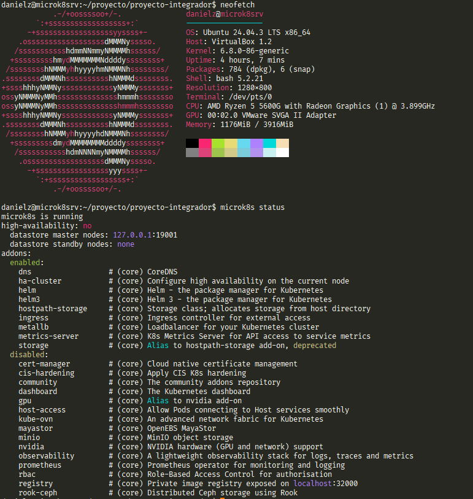

  > Estado despliege

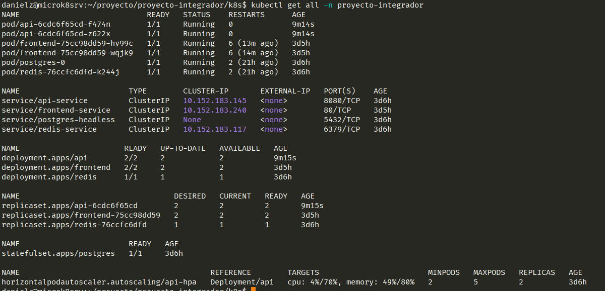

  > Estado de los pods

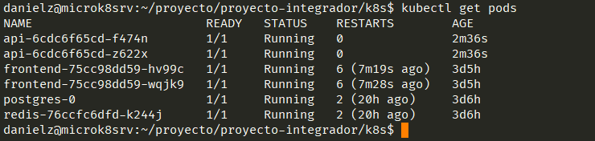

  > Acceso WEB por Clusted IP

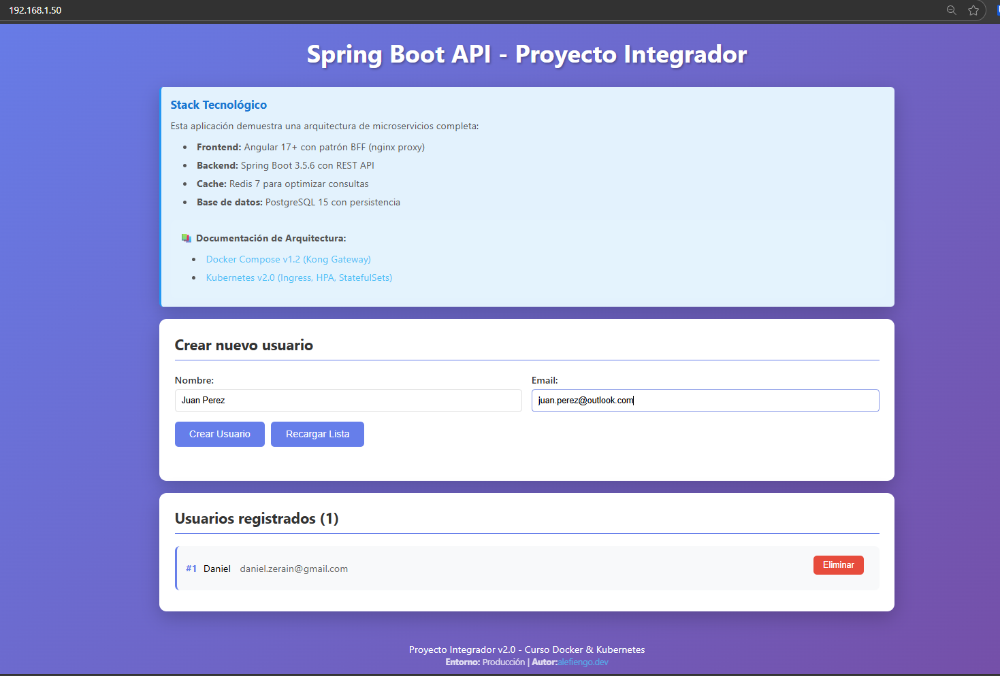

## Parte 2: Backend v2.1

Se realizaron cambios en el endpoint api/info, se reemplazo informacion del proyecto, una vez realizados los cambios se genero una nueva imagen, la misma fue cargada a [DockerHub](https://hub.docker.com/r/danielzerain/springboot-api) para realizar el despliegue correspondiente.

  > Cambios en el codigo

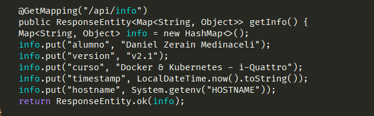

  > rollout

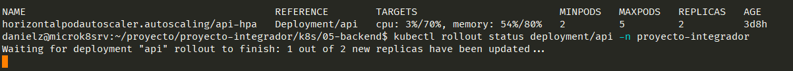


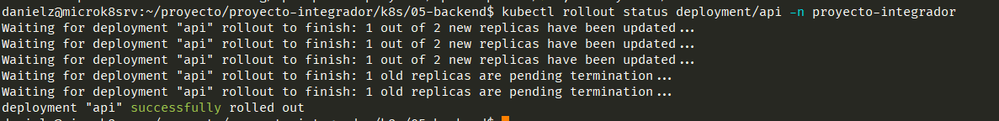

  > Evidencia de cambios realizados

*Antes*

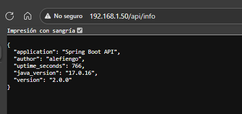

*Con cambios*

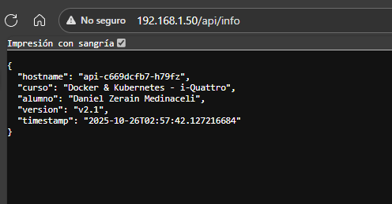

## Parte 3: Frontend v2.2

Se realizaron cambios en el frontend, se adiciona la funcionalidad para el consumo del endpoint api/info, una vez realizados los cambios se genero una nueva imagen con la version 2.2, la misma fue cargada a [DockerHub](https://hub.docker.com/r/danielzerain/angular-frontend) para realizar el despliegue correspondiente.

  > rollout

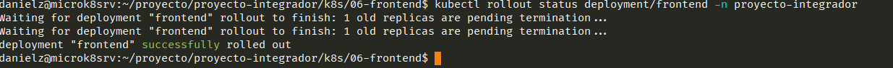

  > Cambios realizados

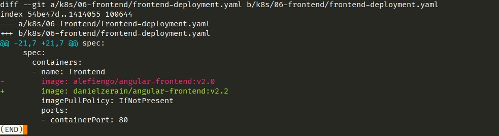

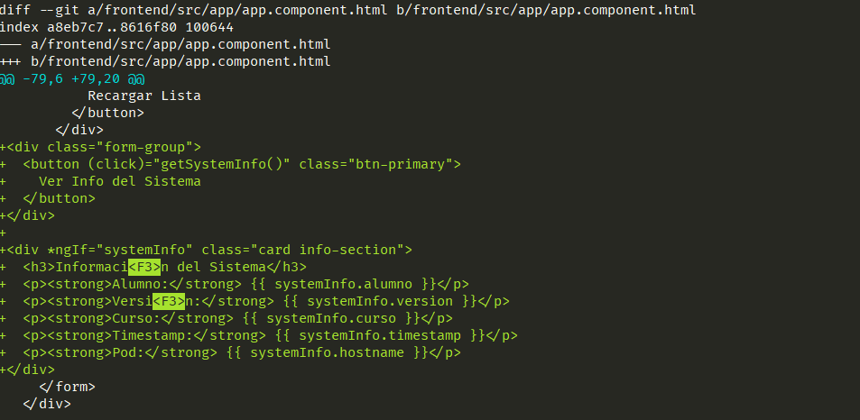

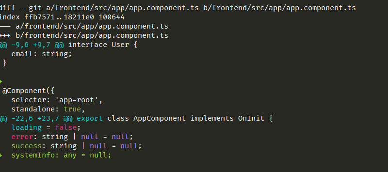

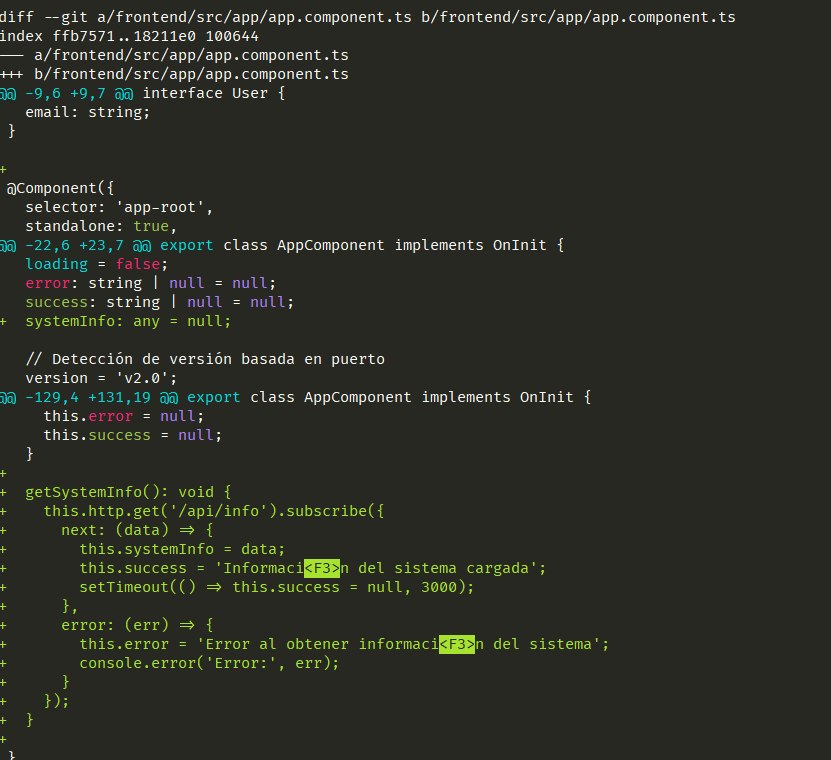

  > Cambios aplicado

Se implementa el consumo del cambio en el servicio de api/info

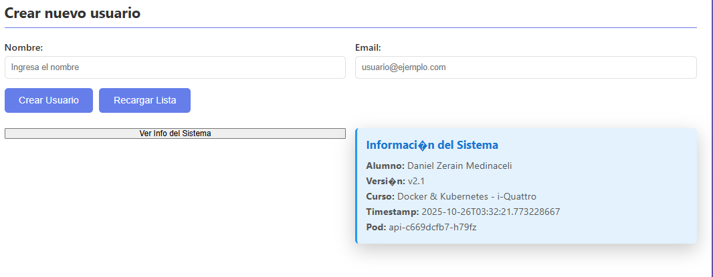

## Parte 4: Gestion de Versiones

### ¿Qué hace kubectl rollout undo?

El comando kubectl rollout undo se utiliza para revertir una implementación a una versión anterior.

```bash
kubectl rollout undo deployment/api -n proyecto-integrador
```

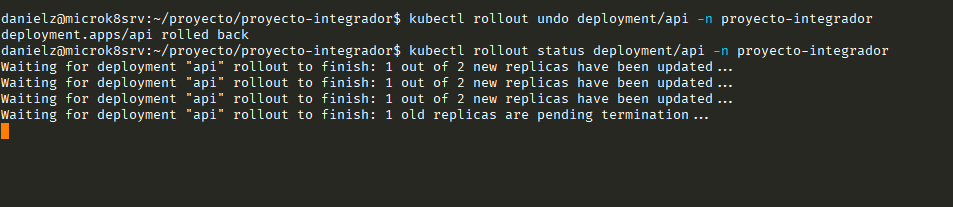

Para ver el historial de las versiones

```bash
kubectl rollout history deployment/api -n proyecto-integrador
```

Para volver a desplegar de nuevo a la nueva version

```bash
kubectl rollout undo deployment/api --to-revision=2 -n proyecto-integrador
```

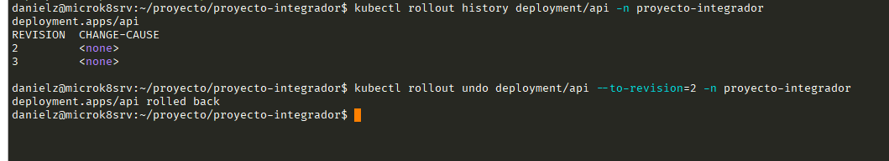

## Parte 5: Ingress + MetalLB

```bash
kubectl get ingress -n proyecto-integrador
```

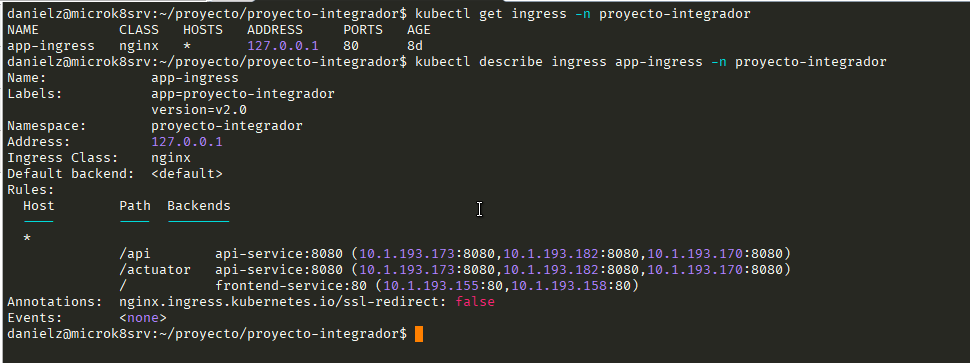

Para ver las direcciones asignadas a metallb se ejecuta el siguiente comando

```bash
kubectl get describe ipaddresspool default-addresspool -m metallb-system
```

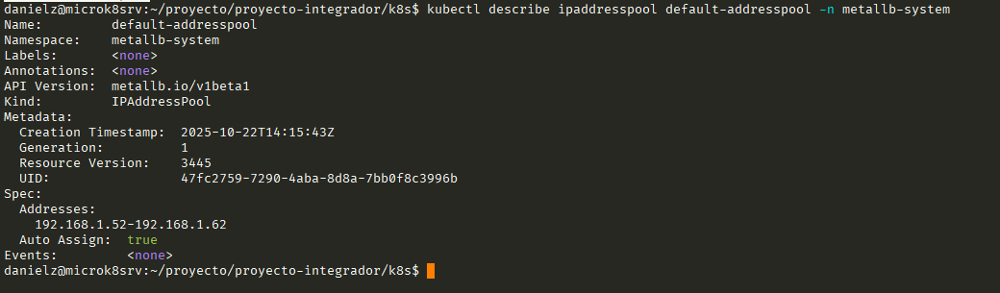

Para utilizar metallb se cambio el servicio a ClusterIP

```yaml
apiVersion: v1
kind: Service
metadata:
  name: api-service
  namespace: proyecto-integrador
  labels:
    app: api
    tier: backend
spec:
  type: ClusterIP
  selector:
    app: api
  ports:
  - port: 8080
    targetPort: 8080
    protocol: TCP
    name: http

```

Con este cambio se pudo utilizar el acceso en el rango de IP asignadas a metalLB

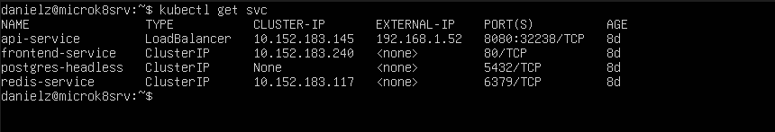

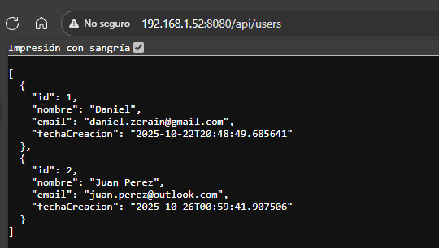


## Conclusiones

### Aprendizajes principales
- Utilizacion de Kubernetes para despliegues que permitan ser escalados, desplegados en pocos pasos
- Volver a versiones anteriores antes posibles problemas en los despliegues 
- Organizacion de los manifiestos de despliegues

### Dificultades encontradas
- Se tuvo dificultad con al cantidad de procesadores asignados a la maquina virtual, lo que no permitia iniciar los pods del backend


### Reflexión
Aplicar Kubernetes en un proyecto real implica usarlo como plataforma para orquestar, escalar y mantener servicios backend, Frontend de forma confiable. Se tiene que tener una buena aplicacion de los manifiestos para realizar un correcto despliegue
